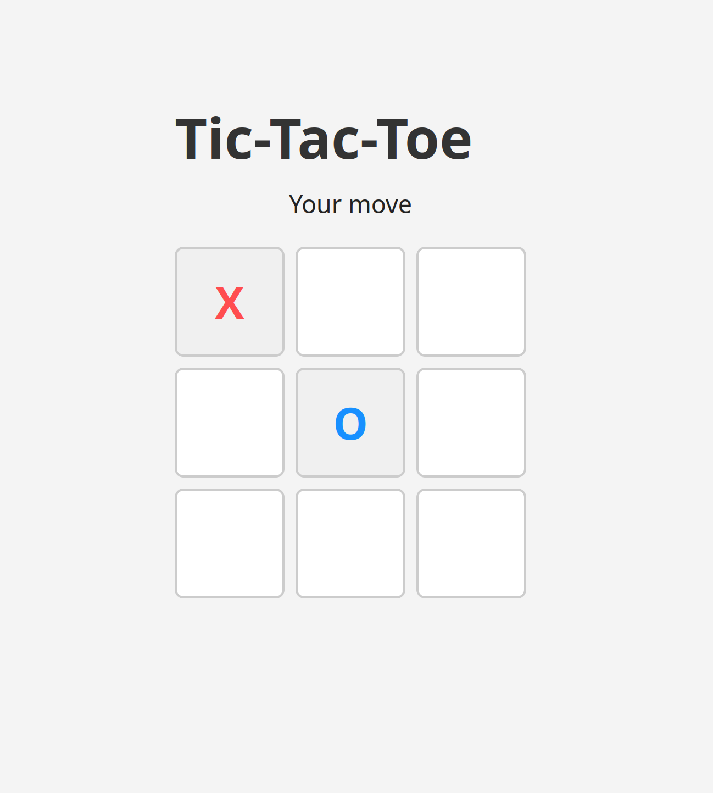

# Tic-Tac-Toe Web Game

[](https://github.com/ghudeihed/tic-tac-toe/actions)
[](https://codecov.io/gh/ghudeihed/tic-tac-toe)
[](https://opensource.org/licenses/MIT)
[](https://hub.docker.com)

A modern, production-ready Tic-Tac-Toe game with a React frontend and Flask backend. Features intelligent computer opponent, comprehensive testing, and full Docker deployment support.

## 🎮 Live Demo

**[Play Now →](http://tic-tac-toe-alb-1026809040.us-east-1.elb.amazonaws.com/)**



*Experience the smart computer opponent in action!*

## Features

- **Smart Computer Opponent** - Strategic algorithms (win, block, fork, center, corners)
- **Modern Frontend** - React with Vite for fast development and optimized builds
- **High Performance** - Sub-100ms API response times, optimized frontend bundle
- **Scalable** - Handles 1000+ concurrent games with Redis rate limiting
- **Production Security** - Rate limiting, input validation, security headers, and error tracking
- **Docker Ready** - Full containerization with separate development and production configurations
- **Comprehensive Testing** - 95%+ test coverage with unit and integration tests
- **CI/CD Ready** - GitHub Actions workflow and deployment automation
- **Monitoring** - Health checks, structured logging, and application metrics

## Tech Stack

- **Frontend**: React 19, Vite 6, Modern CSS
- **Backend**: Flask, Python 3.11, Marshmallow validation
- **Production**: Gunicorn, Nginx, Redis (rate limiting)
- **DevOps**: Docker, Docker Compose, Multi-stage builds
- **Testing**: pytest, coverage, ESLint
- **Monitoring**: Sentry integration, structured logging

## Quick Start

### Prerequisites
- Python 3.11+
- Node.js 18+
- Docker & Docker Compose (for containerized setup)

### Option 1: Docker (Recommended)

```bash
# Clone the repository
git clone https://github.com/ghudeihed/tic-tac-toe.git
cd tic-tac-toe

# Development environment
make dev

# Production environment
make env-setup  # Set up environment files
make prod
```

### Option 2: Local Development

**Backend Setup:**
```bash
cd server
python3 -m venv venv
source venv/bin/activate  # On Windows: venv\Scripts\activate
pip install -r requirements.txt
python main.py
```

**Frontend Setup:**
```bash
cd client
npm install
npm run dev
```

**Access the Application:**
- Frontend: http://localhost:5173
- Backend API: http://localhost:5000
- Health Check: http://localhost:5000/health

## Testing

```bash
# Run all tests with coverage
make test

# Test individual services
make test-frontend  # Linting
make test-local     # Backend tests locally

# Clean coverage files
make clean-coverage
```

## Production Deployment

### Full Stack Deployment
```bash
# Deploy everything
make deploy

# Check health
make health

# View logs
make logs
```

### Separate Service Deployment
```bash
# Deploy only backend
make deploy-backend

# Deploy only frontend
make deploy-frontend

# Health checks
make health-backend
make health-frontend
```

### Environment Configuration

Copy example files and customize:

```bash
# Backend configuration
cp server/.env.example server/.env.production
cp client/.env.example client/.env.production

# Edit with your values
nano server/.env.production
```

**Required Environment Variables:**

| Variable | Description | Example |
|----------|-------------|---------|
| `SECRET_KEY` | Flask secret key | `super-secret-key-here` |
| `ALLOWED_ORIGINS` | CORS origins | `https://game-domain-name.com` |
| `REDIS_URL` | Redis connection | `redis://redis:6379` |
| `SENTRY_DSN` | Error tracking | `https://...ingest.sentry.io/...` |
| `VITE_API_URL` | Backend API URL | `https://api.game-domain-name.com` |

**Backend Environment (`server/.env.production`):**
```bash
FLASK_ENV=production
SECRET_KEY=secure-secret-key
ALLOWED_ORIGINS=https://game-domain-name.com
REDIS_URL=redis://redis:6379
LOG_LEVEL=INFO
SENTRY_DSN=sentry-dsn
```

**Frontend Environment (`client/.env.production`):**
```bash
VITE_API_URL=https://api.game-domain-name.com
VITE_APP_VERSION=1.0.0
VITE_ENABLE_ANALYTICS=true
```

## Project Structure

```
tic-tac-toe/
├── client/                          # React Frontend
│   ├── public/
│   │   └── vite.svg                 # Application icon
│   ├── src/
│   │   ├── assets/                  # Static assets
│   │   ├── App.jsx                  # Main application component
│   │   ├── App.css                  # Application styles
│   │   ├── index.css                # Global styles
│   │   └── main.jsx                 # Application entry point
│   ├── Dockerfile                   # Development container
│   ├── Dockerfile.prod              # Production container
│   ├── nginx.conf                   # Production nginx config
│   ├── eslint.config.js             # ESLint configuration
│   ├── vite.config.js               # Vite configuration
│   ├── package.json                 # Dependencies & scripts
│   ├── package-lock.json            # Dependency lock file
│   ├── index.html                   # HTML template
│   └── README.md                    # React documentation
├── server/                          # Flask Backend
│   ├── config/
│   │   ├── __init__.py
│   │   ├── config.py                # Base configuration
│   │   ├── development.py           # Development config
│   │   ├── production.py            # Production config
│   │   └── testing.py               # Testing config
│   ├── tests/                       # Test suite
│   │   ├── __init__.py
│   │   ├── conftest.py              # Test configuration
│   │   ├── test_config.py           # Configuration tests
│   │   ├── test_game.py             # Game logic tests
│   │   └── test_main.py             # API endpoint tests
│   ├── __init__.py
│   ├── game.py                      # Game logic & strategy
│   ├── main.py                      # Flask application
│   ├── schemas.py                   # Input validation schemas
│   ├── Dockerfile                   # Development container
│   ├── Dockerfile.prod              # Production container
│   ├── pytest.ini                  # Pytest configuration
│   ├── requirements.txt             # Python dependencies
├── .github/
│   └── workflows/
│       └── ci-cd.yml                # GitHub Actions CI/CD
├── .aws/
│   └── task-definition.json         # ECS task definition
├── scripts/
│   └── setup-aws-infrastructure.sh  # AWS setup script
├── docker-compose.yml               # Development setup
├── docker-compose.prod.yml          # Production setup
├── docker-compose.backend.yml       # Backend only deployment
├── docker-compose.frontend.yml      # Frontend only deployment
├── Makefile                         # Development commands
└── README.md                        # This file
```

## API Endpoints

| Endpoint | Method | Description |
|----------|--------|-------------|
| `/health` | GET | Comprehensive health status |
| `/move` | POST | Make a game move |

**Move Request:**
```json
{
  "board": [null, null, null, null, null, null, null, null, null],
  "index": 4
}
```

**Move Response:**
```json
{
  "board": ["X", null, null, null, "O", null, null, null, null],
  "status": "in_progress"
}
```

## Computer Strategy

The computer opponent uses a sophisticated strategy hierarchy:

1. **Win** - Take winning move if available
2. **Block** - Block human's winning move
3. **Fork** - Create multiple winning opportunities
4. **Block Fork** - Prevent human's fork
5. **Center** - Take center position (4)
6. **Opposite Corner** - Take corner opposite to human
7. **Empty Corner** - Take any available corner
8. **Empty Side** - Take any available side

## Development Commands

```bash
# Development
make dev                    # Run development environment
make dev-backend           # Backend only
make dev-frontend          # Frontend only

# Production
make prod                  # Full production deployment
make prod-backend          # Backend only
make prod-frontend         # Frontend only

# Testing
make test                  # Run all tests with coverage
make test-no-coverage      # Tests without coverage
make test-local            # Local backend tests

# Utilities
make clean                 # Clean containers and images
make logs                  # View logs
make health               # Check application health
make env-setup            # Set up environment files
```

## Deployment Options

### Cloud Deployment
- **AWS**: ECS + CloudFront + ElastiCache
- **GCP**: Cloud Run + CDN + Memorystore
- **Azure**: Container Instances + CDN + Redis

### Static Hosting + API
- **Frontend**: Vercel, Netlify, Cloudflare Pages
- **Backend**: Railway, Render, Fly.io

### Self-Hosted
- **VPS**: DigitalOcean, Linode, Vultr
- **Kubernetes**: Any managed K8s service

## Monitoring & Observability

- **Health Checks**: `/health` endpoint with detailed status
- **Structured Logging**: JSON logs with correlation IDs
- **Error Tracking**: Sentry integration
- **Metrics**: Application performance monitoring
- **Rate Limiting**: Redis-backed protection

## 🔒 Security

This application implements security best practices:
- Rate limiting (100 requests/minute per IP)
- Input validation and sanitization
- CORS protection
- Security headers (CSP, HSTS, etc.)
- No sensitive data in logs
- Production secrets management

**Security Reporting:** Please report security vulnerabilities privately to [security@game-domain-name.com]

## 🔧 Troubleshooting

### Common Issues

**Port already in use:**
```bash
make stop  # Stop all containers
# Or kill specific processes
lsof -ti:5173 | xargs kill -9  # Frontend
lsof -ti:5000 | xargs kill -9  # Backend
```

**Docker build fails:**
```bash
make clean        # Clean everything
docker system prune -f  # Remove unused Docker data
make dev          # Rebuild
```

**Tests failing locally:**
```bash
# Ensure proper Python path
cd server
export PYTHONPATH=.
pytest -v
```

**Frontend build errors:**
```bash
cd client
rm -rf node_modules package-lock.json
npm install
npm run build
```

**Environment variables not loading:**
```bash
# Check if .env files exist
ls -la server/.env* client/.env*

# Set up missing environment files
make env-setup
```

**Redis connection issues:**
```bash
# Check if Redis is running
docker ps | grep redis

# Restart Redis
docker compose restart redis
```

## Contributing

1. Fork the repository: `git clone https://github.com/ghudeihed/tic-tac-toe.git`
2. Create a feature branch: `git checkout -b feature/amazing-feature`
3. Make your changes and add tests
4. Ensure tests pass: `make test`
5. Commit your changes: `git commit -m 'Add amazing feature'`
6. Push to the branch: `git push origin feature/amazing-feature`
7. Open a Pull Request

### Development Guidelines

- Follow existing code style and patterns
- Add tests for new features
- Update documentation as needed
- Ensure Docker builds work
- Test both development and production setups

### Code Review Process

1. All PRs require review from a maintainer
2. Tests must pass in CI/CD pipeline
3. Coverage should not decrease
4. Documentation updates may be required

## License

This project is licensed under the MIT License - see the [LICENSE](LICENSE) file for details.

---

**Ready to play?** Start with `make dev` and visit http://localhost:5173!

**Need help?** Check the [Troubleshooting](#-troubleshooting) section or open an issue.